# `pele_dart` Visual Diagram Gallery (33 Diagram Families)

Every image below is rendered directly by **`pele_dart`** in pure Dart (`SvgOutputMode.flattened`) with zero browser or JavaScript runtime.

> Regenerate this gallery at any time with:
> ```bash
> dart run tool/generate_doc_images.dart
> ```

## Quick Jump

- [**Flowchart** (`flowchart`)](#flowchart) — Show the steps and decisions in a process.
- [**Block** (`block`)](#block) — Show blocks in a grid that you arrange yourself.
- [**C4** (`c4`)](#c4) — Show a software system as people, systems, containers, and components.
- [**Class** (`class`)](#class) — Show classes, their members, and the relationships between them.
- [**Entity relationship** (`er`)](#entity-relationship) — Show entities, their attributes, and the relationships between them.
- [**Event modeling** (`eventmodeling`)](#event-modeling) — Show how commands, events, and views change a system over time.
- [**Gantt** (`gantt`)](#gantt) — Show the tasks of a project on a timeline.
- [**Git graph** (`git`)](#git-graph) — Show commits, branches, and merges.
- [**Info** (`info`)](#info) — Display package version info.
- [**User journey** (`journey`)](#user-journey) — Show the steps of a task and how satisfying each one is.
- [**Kanban** (`kanban`)](#kanban) — Show tasks in columns by status.
- [**Mindmap** (`mindmap`)](#mindmap) — Show ideas branching out from a central topic.
- [**Packet** (`packet`)](#packet) — Show the fields of a network packet.
- [**Pie** (`pie`)](#pie) — Show the parts of a whole.
- [**Quadrant chart** (`quadrant`)](#quadrant-chart) — Plot items on two axes that divide the chart into four sections.
- [**Requirement** (`requirement`)](#requirement) — Show requirements and how they relate to each other and to the elements that satisfy them.
- [**Sankey** (`sankey`)](#sankey) — Show flows between nodes, with widths proportional to quantity.
- [**Sequence** (`sequence`)](#sequence) — Show the messages that participants exchange over time.
- [**State** (`state`)](#state) — Show the states of a system and the transitions between them.
- [**Timeline** (`timeline`)](#timeline) — Show events in chronological order.
- [**XY chart** (`xychart`)](#xy-chart) — Plot data as bars and lines on two axes.
- [**Agentflow** (`agentflow`)](#agentflow) — Show the tasks of AI agents and how work passes between them.
- [**Architecture** (`architecture`)](#architecture) — Show services and the connections between them.
- [**Cynefin** (`cynefin`)](#cynefin) — Sort items into the five domains of the Cynefin framework.
- [**Ishikawa** (`ishikawa`)](#ishikawa) — Show the causes that contribute to a problem.
- [**Radar** (`radar`)](#radar) — Compare values across several axes.
- [**Railroad** (`railroad`)](#railroad) — Show the syntax of a grammar.
- [**Swimlane** (`swimlane`)](#swimlane) — Show a process divided by who performs each step.
- [**Treemap** (`treemap`)](#treemap) — Show hierarchical data as nested rectangles, sized by value.
- [**Tree view** (`treeview`)](#tree-view) — Show a hierarchy, such as files and folders.
- [**Use case** (`usecase`)](#use-case) — Show actors and the goals they reach with a system.
- [**Venn** (`venn`)](#venn) — Show sets and where they overlap.
- [**Wardley map** (`wardley`)](#wardley-map) — Plot components by their visibility to the user and their stage of evolution.

---

## Flowchart

**Type:** `flowchart` (`flowchart-v2`) · **Intrinsic Size:** `1046×225 px` · Show the steps and decisions in a process.

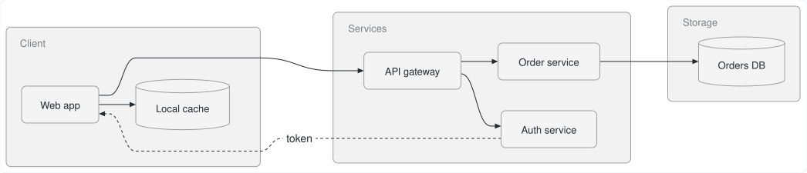

<details>
<summary>View Mermaid Source</summary>

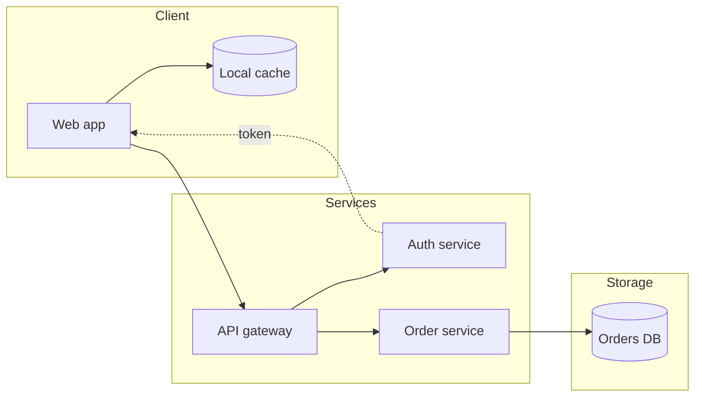
```mermaid
flowchart LR
  subgraph Client
    UI[Web app]
    Cache[(Local cache)]
  end
  subgraph Services
    API[API gateway]
    Auth[Auth service]
    Orders[Order service]
  end
  subgraph Storage
    DB[(Orders DB)]
  end
  UI --> API
  UI --> Cache
  API --> Auth
  API --> Orders
  Orders --> DB
  Auth -. token .-> UI
```
</details>

---

## Block

**Type:** `block` (`block`) · **Intrinsic Size:** `695×424 px` · Show blocks in a grid that you arrange yourself.

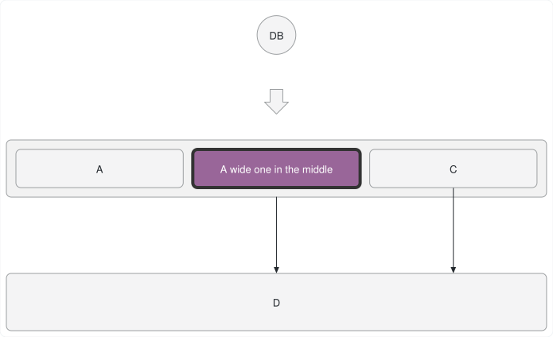

<details>
<summary>View Mermaid Source</summary>

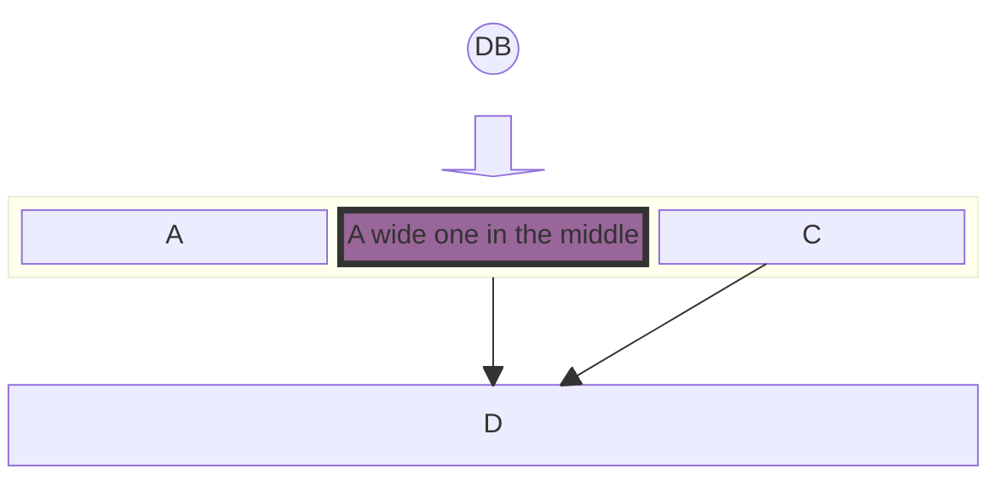
```mermaid
block
columns 1
  db(("DB"))
  blockArrowId6<["&nbsp;&nbsp;&nbsp;"]>(down)
  block:ID
    A
    B["A wide one in the middle"]
    C
  end
  space
  D
  ID --> D
  C --> D
  style B fill:#969,stroke:#333,stroke-width:4px
```
</details>

---

## C4

**Type:** `c4` (`c4`) · **Intrinsic Size:** `1016×1382 px` · Show a software system as people, systems, containers, and components.

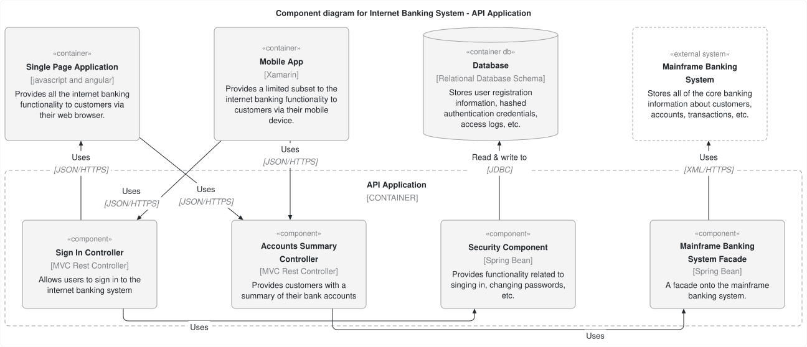

<details>
<summary>View Mermaid Source</summary>

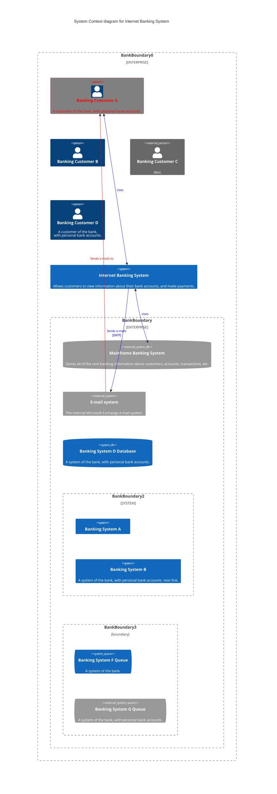
```mermaid
C4Context
      title System Context diagram for Internet Banking System
      Enterprise_Boundary(b0, "BankBoundary0") {
        Person(customerA, "Banking Customer A", "A customer of the bank, with personal bank accounts.")
        Person(customerB, "Banking Customer B")
        Person_Ext(customerC, "Banking Customer C", "desc")

        Person(customerD, "Banking Customer D", "A customer of the bank, <br/> with personal bank accounts.")

        System(SystemAA, "Internet Banking System", "Allows customers to view information about their bank accounts, and make payments.")

        Enterprise_Boundary(b1, "BankBoundary") {

          SystemDb_Ext(SystemE, "Mainframe Banking System", "Stores all of the core banking information about customers, accounts, transactions, etc.")

          System_Boundary(b2, "BankBoundary2") {
            System(SystemA, "Banking System A")
            System(SystemB, "Banking System B", "A system of the bank, with personal bank accounts. next line.")
          }

          System_Ext(SystemC, "E-mail system", "The internal Microsoft Exchange e-mail system.")
          SystemDb(SystemD, "Banking System D Database", "A system of the bank, with personal bank accounts.")

          Boundary(b3, "BankBoundary3", "boundary") {
            SystemQueue(SystemF, "Banking System F Queue", "A system of the bank.")
            SystemQueue_Ext(SystemG, "Banking System G Queue", "A system of the bank, with personal bank accounts.")
          }
        }
      }

      BiRel(customerA, SystemAA, "Uses")
      BiRel(SystemAA, SystemE, "Uses")
      Rel(SystemAA, SystemC, "Sends e-mails", "SMTP")
      Rel(SystemC, customerA, "Sends e-mails to")

      UpdateElementStyle(customerA, $fontColor="red", $bgColor="gray", $borderColor="red")
      UpdateRelStyle(customerA, SystemAA, $textColor="blue", $lineColor="blue", $offsetX="5")
      UpdateRelStyle(SystemAA, SystemE, $textColor="blue", $lineColor="blue", $offsetY="-10")
      UpdateRelStyle(SystemAA, SystemC, $textColor="blue", $lineColor="blue", $offsetY="-40", $offsetX="-50")
      UpdateRelStyle(SystemC, customerA, $textColor="red", $lineColor="red", $offsetX="-50", $offsetY="20")

      UpdateLayoutConfig($c4ShapeInRow="3", $c4BoundaryInRow="1")
```
</details>

---

## Class

**Type:** `class` (`classDiagram`) · **Intrinsic Size:** `771×423 px` · Show classes, their members, and the relationships between them.

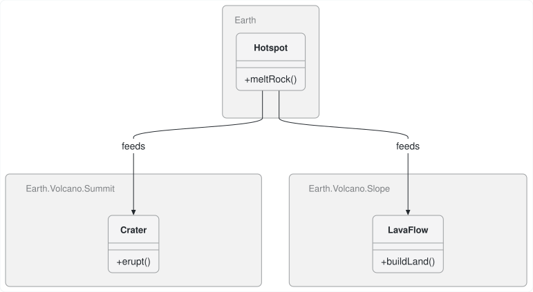

<details>
<summary>View Mermaid Source</summary>

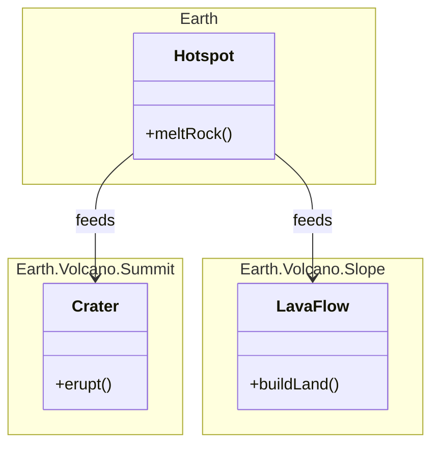
```mermaid
---
config:
  class:
    hierarchicalNamespaces: false
---
classDiagram
    namespace Earth.Volcano.Summit {
        class Crater {
            +erupt()
        }
    }
    namespace Earth.Volcano.Slope {
        class LavaFlow {
            +buildLand()
        }
    }
    namespace Earth {
        class Hotspot {
            +meltRock()
        }
    }
    Hotspot --> Crater : feeds
    Hotspot --> LavaFlow : feeds
```
</details>

---

## Entity relationship

**Type:** `er` (`er`) · **Intrinsic Size:** `304×500 px` · Show entities, their attributes, and the relationships between them.

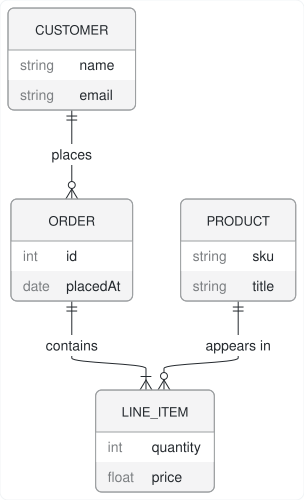

<details>
<summary>View Mermaid Source</summary>

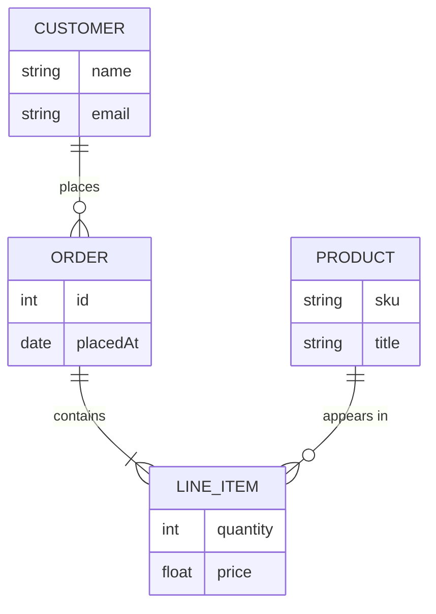
```mermaid
---
config:
  theme: default
  look: classic
  layout: dagre
---
erDiagram
  CUSTOMER ||--o{ ORDER : places
  ORDER ||--|{ LINE_ITEM : contains
  PRODUCT ||--o{ LINE_ITEM : "appears in"
  CUSTOMER {
    string name
    string email
  }
  ORDER {
    int id
    date placedAt
  }
  LINE_ITEM {
    int quantity
    float price
  }
  PRODUCT {
    string sku
    string title
  }
```
</details>

---

## Event modeling

**Type:** `eventmodeling` (`eventmodeling`) · **Intrinsic Size:** `482×273 px` · Show how commands, events, and views change a system over time.

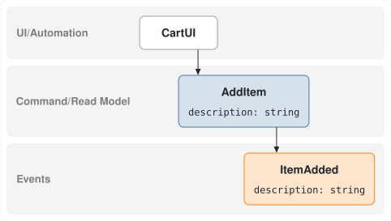

<details>
<summary>View Mermaid Source</summary>

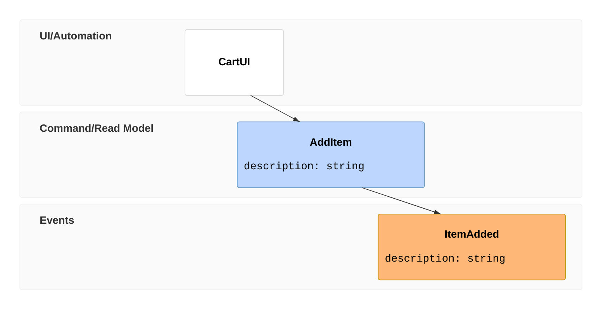
```mermaid
eventmodeling

timeframe 01 ui CartUI
timeframe 02 command AddItem { description: string }
timeframe 03 event ItemAdded { description: string }
```
</details>

---

## Gantt

**Type:** `gantt` (`gantt`) · **Intrinsic Size:** `800×197 px` · Show the tasks of a project on a timeline.

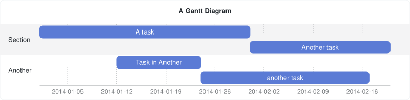

<details>
<summary>View Mermaid Source</summary>

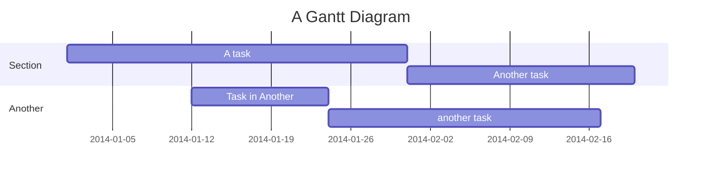
```mermaid
gantt
    title A Gantt Diagram
    dateFormat YYYY-MM-DD
    section Section
        A task          :a1, 2014-01-01, 30d
        Another task    :after a1, 20d
    section Another
        Task in Another :2014-01-12, 12d
        another task    :24d
```
</details>

---

## Git graph

**Type:** `gitGraph` (`gitGraph`) · **Intrinsic Size:** `838×522 px` · Show commits, branches, and merges.

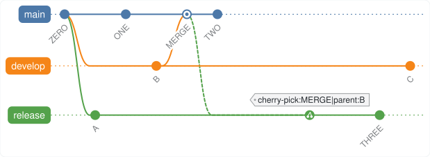

<details>
<summary>View Mermaid Source</summary>

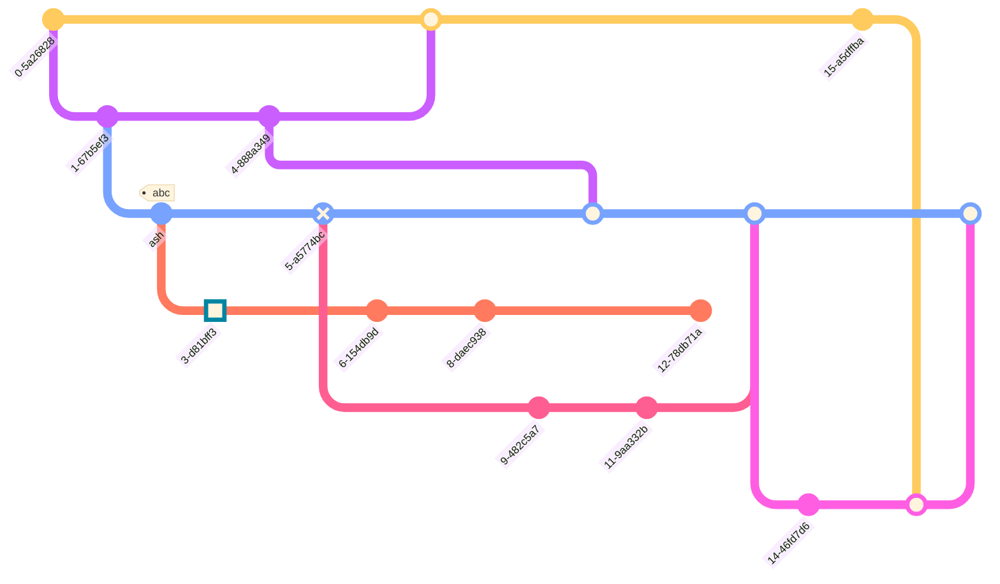
```mermaid
---
config:
  logLevel: 'debug'
  theme: 'base'
  gitGraph:
    showBranches: false
---
      gitGraph
        commit
        branch hotfix
        checkout hotfix
        commit
        branch develop
        checkout develop
        commit id:"ash" tag:"abc"
        branch featureB
        checkout featureB
        commit type:HIGHLIGHT
        checkout main
        checkout hotfix
        commit type:NORMAL
        checkout develop
        commit type:REVERSE
        checkout featureB
        commit
        checkout main
        merge hotfix
        checkout featureB
        commit
        checkout develop
        branch featureA
        commit
        checkout develop
        merge hotfix
        checkout featureA
        commit
        checkout featureB
        commit
        checkout develop
        merge featureA
        branch release
        checkout release
        commit
        checkout main
        commit
        checkout release
        merge main
        checkout develop
        merge release
```
</details>

---

## Info

**Type:** `info` (`info`) · **Intrinsic Size:** `105×40 px` · Display package version info.

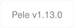

<details>
<summary>View Mermaid Source</summary>

```mermaid
info
```
</details>

---

## User journey

**Type:** `journey` (`journey`) · **Intrinsic Size:** `808×327 px` · Show the steps of a task and how satisfying each one is.

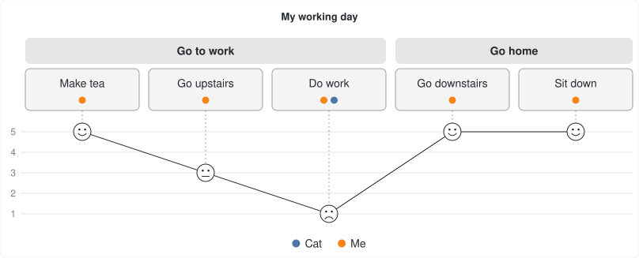

<details>
<summary>View Mermaid Source</summary>

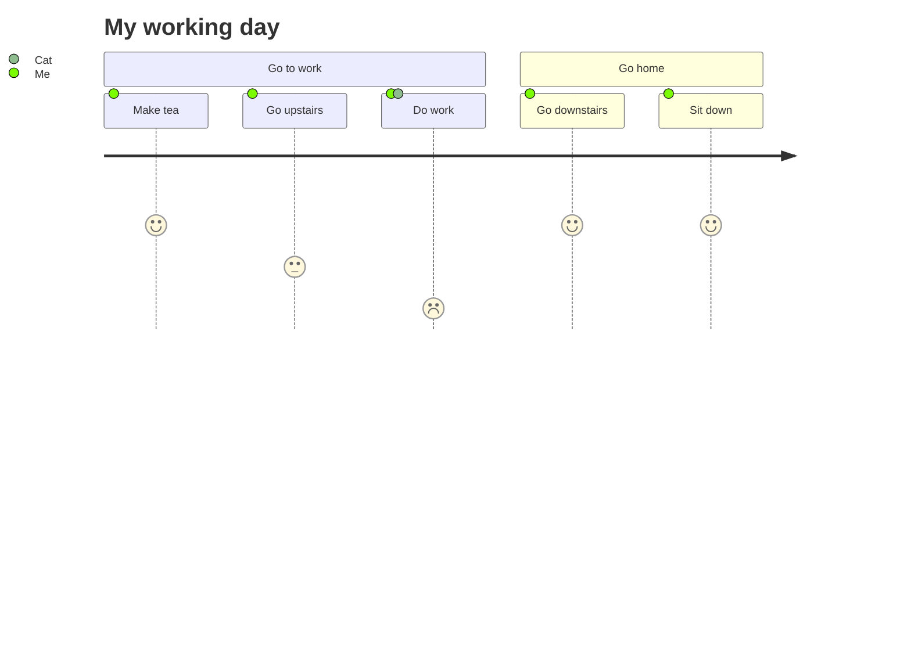
```mermaid
journey
    title My working day
    section Go to work
      Make tea: 5: Me
      Go upstairs: 3: Me
      Do work: 1: Me, Cat
    section Go home
      Go downstairs: 5: Me
      Sit down: 5: Me
```
</details>

---

## Kanban

**Type:** `kanban` (`kanban`) · **Intrinsic Size:** `216×105 px` · Show tasks in columns by status.

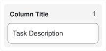

<details>
<summary>View Mermaid Source</summary>

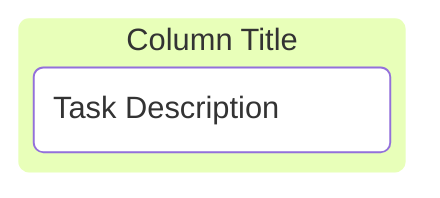
```mermaid
kanban
  column1[Column Title]
    task1[Task Description]
```
</details>

---

## Mindmap

**Type:** `mindmap` (`mindmap`) · **Intrinsic Size:** `1064×248 px` · Show ideas branching out from a central topic.

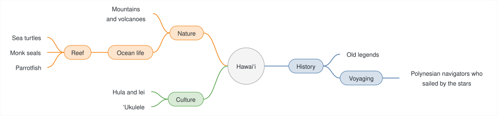

<details>
<summary>View Mermaid Source</summary>

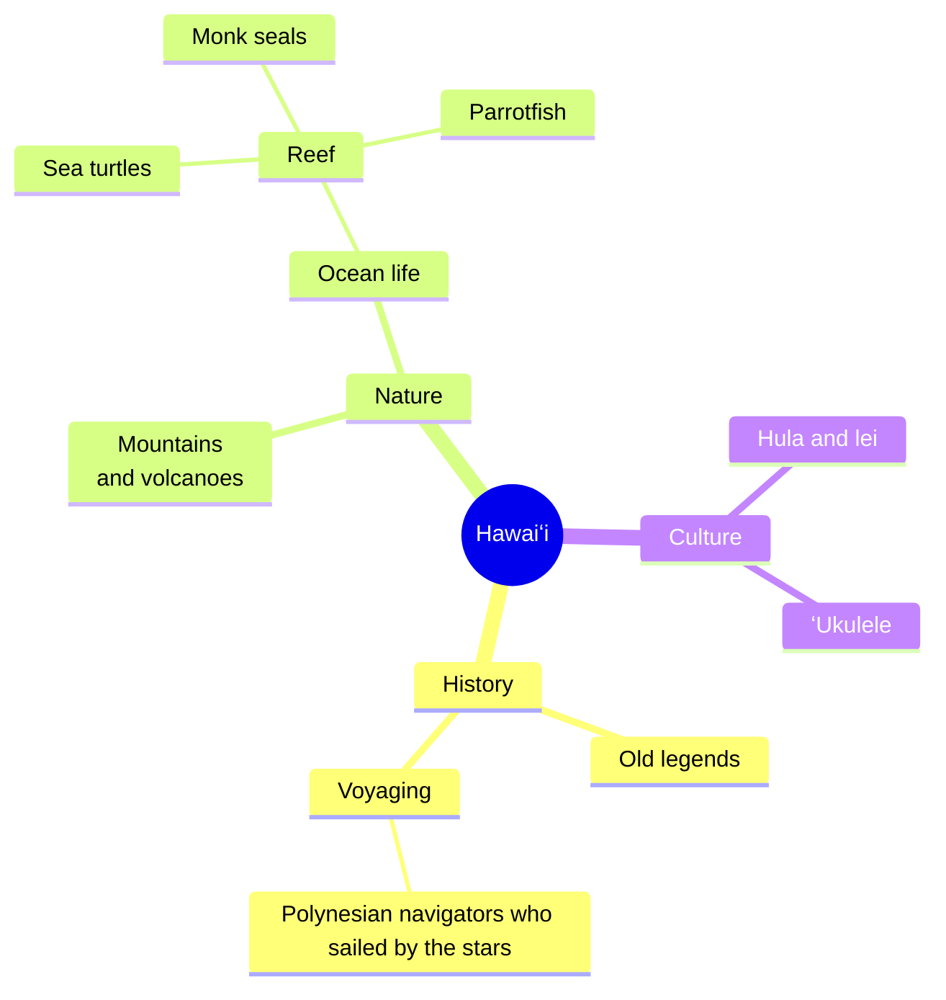
```mermaid
mindmap
  root((Hawaiʻi))
    History
      Old legends
      ::icon(fa fa-book)
      Voyaging
        Polynesian navigators who sailed by the stars
    Nature
      Mountains<br/>and volcanoes
      Ocean life
        Reef
            Sea turtles
            Monk seals
            Parrotfish
    Culture
      Hula and lei
      ʻUkulele
```
</details>

---

## Packet

**Type:** `packet` (`packet`) · **Intrinsic Size:** `1035×455 px` · Show the fields of a network packet.

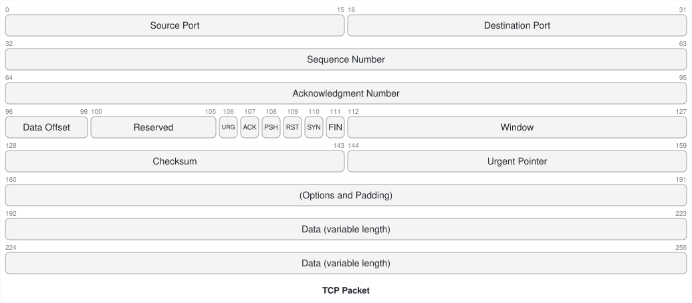

<details>
<summary>View Mermaid Source</summary>

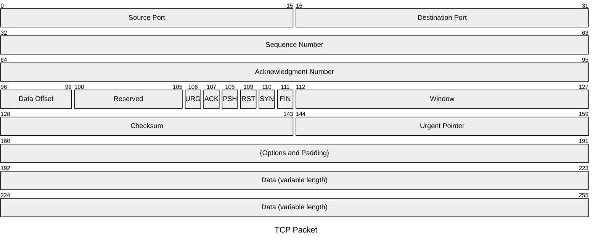
```mermaid
---
title: "TCP Packet"
---
packet
0-15: "Source Port"
16-31: "Destination Port"
32-63: "Sequence Number"
64-95: "Acknowledgment Number"
96-99: "Data Offset"
100-105: "Reserved"
106: "URG"
107: "ACK"
108: "PSH"
109: "RST"
110: "SYN"
111: "FIN"
112-127: "Window"
128-143: "Checksum"
144-159: "Urgent Pointer"
160-191: "(Options and Padding)"
192-255: "Data (variable length)"
```
</details>

---

## Pie

**Type:** `pie` (`pie`) · **Intrinsic Size:** `425×352 px` · Show the parts of a whole.

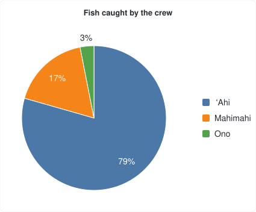

<details>
<summary>View Mermaid Source</summary>

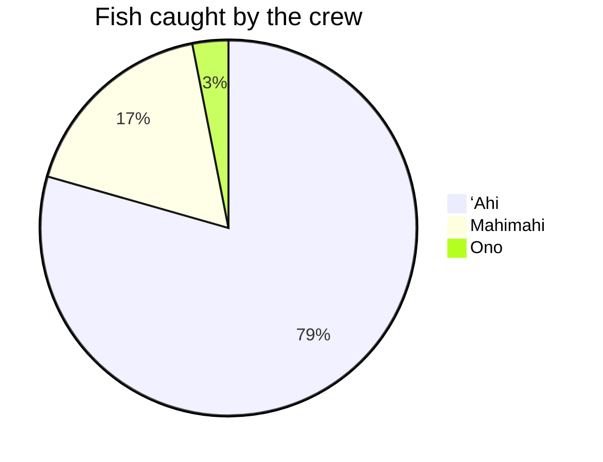
```mermaid
pie title Fish caught by the crew
    "ʻAhi" : 386
    "Mahimahi" : 85
    "Ono" : 15
```
</details>

---

## Quadrant chart

**Type:** `quadrantChart` (`quadrantChart`) · **Intrinsic Size:** `500×500 px` · Plot items on two axes that divide the chart into four sections.

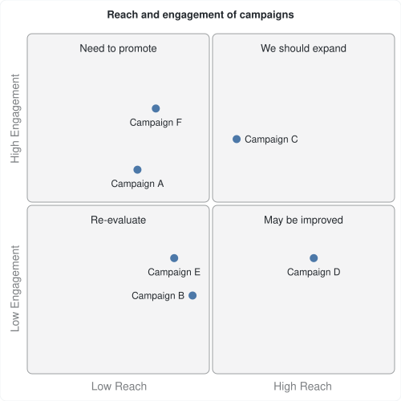

<details>
<summary>View Mermaid Source</summary>

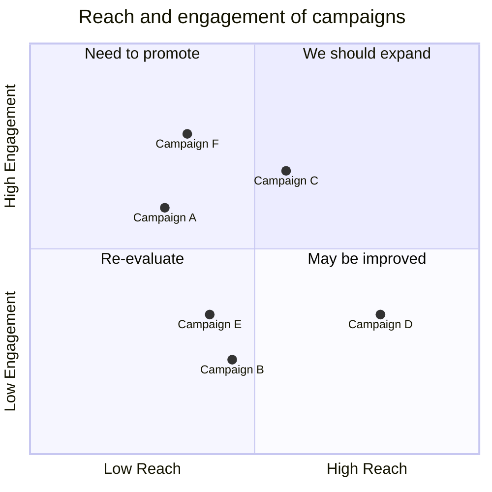
```mermaid
quadrantChart
    title Reach and engagement of campaigns
    x-axis Low Reach --> High Reach
    y-axis Low Engagement --> High Engagement
    quadrant-1 We should expand
    quadrant-2 Need to promote
    quadrant-3 Re-evaluate
    quadrant-4 May be improved
    Campaign A: [0.3, 0.6]
    Campaign B: [0.45, 0.23]
    Campaign C: [0.57, 0.69]
    Campaign D: [0.78, 0.34]
    Campaign E: [0.40, 0.34]
    Campaign F: [0.35, 0.78]
```
</details>

---

## Requirement

**Type:** `requirement` (`requirement`) · **Intrinsic Size:** `523×447 px` · Show requirements and how they relate to each other and to the elements that satisfy them.

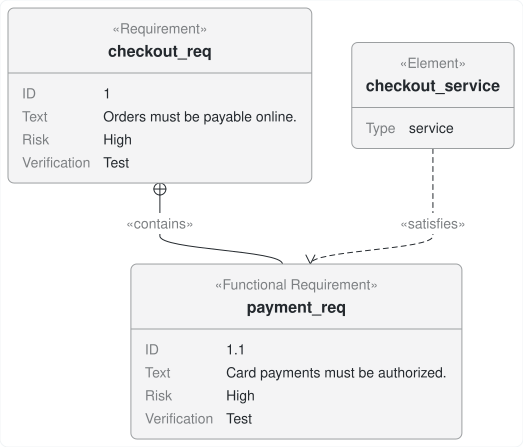

<details>
<summary>View Mermaid Source</summary>

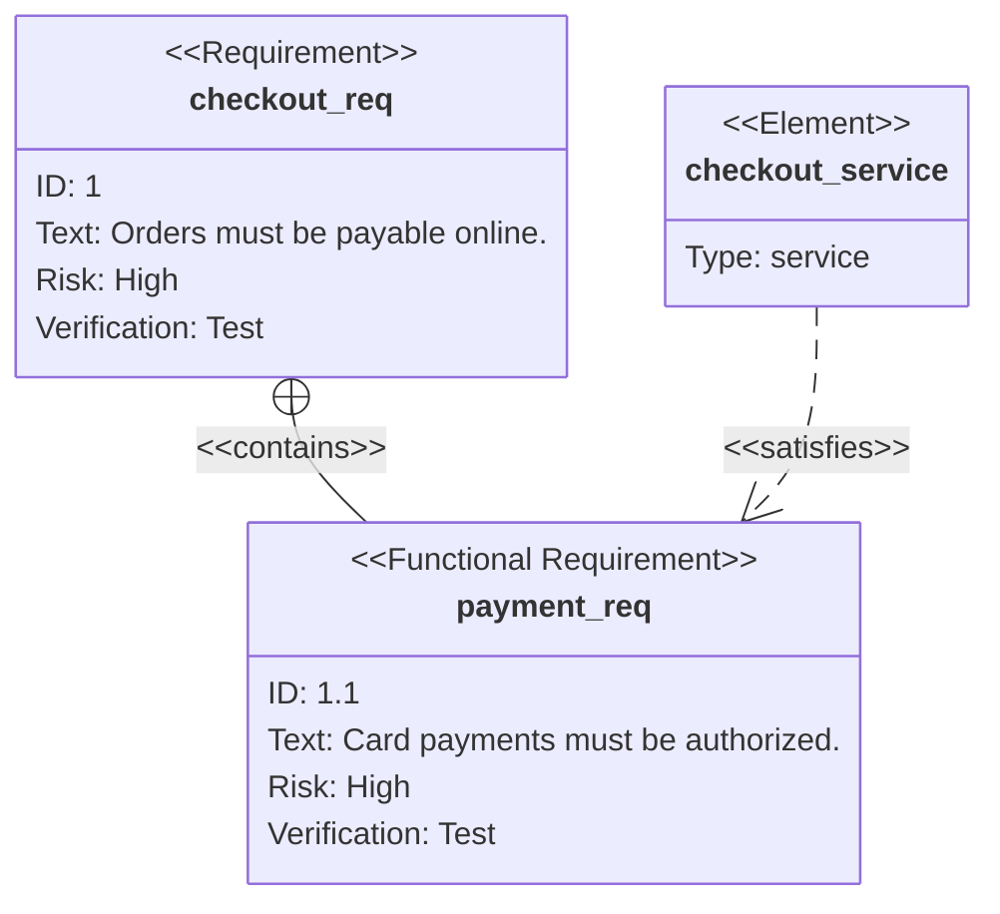
```mermaid
requirementDiagram
  requirement checkout_req {
    id: 1
    text: Orders must be payable online.
    risk: high
    verifymethod: test
  }
  functionalRequirement payment_req {
    id: 1.1
    text: Card payments must be authorized.
    risk: high
    verifymethod: test
  }
  element checkout_service {
    type: service
  }
  checkout_req - contains -> payment_req
  checkout_service - satisfies -> payment_req
```
</details>

---

## Sankey

**Type:** `sankey` (`sankey`) · **Intrinsic Size:** `616×424 px` · Show flows between nodes, with widths proportional to quantity.

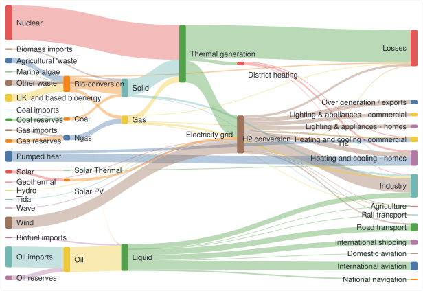

<details>
<summary>View Mermaid Source</summary>

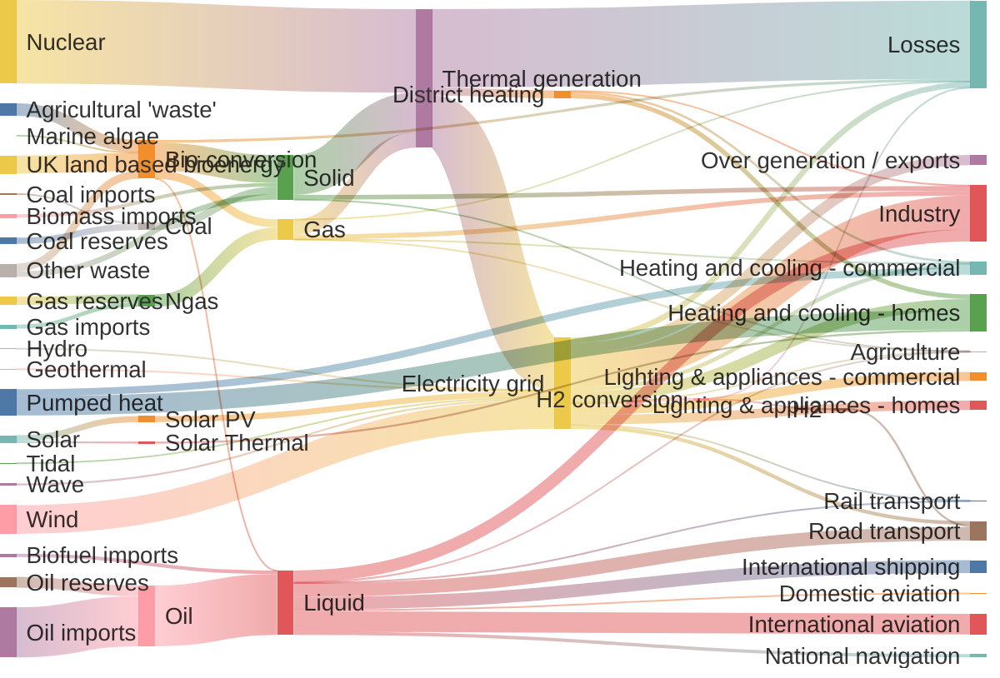
```mermaid
---
config:
  sankey:
    showValues: false
---
sankey

Agricultural 'waste',Bio-conversion,124.729
Bio-conversion,Liquid,0.597
Bio-conversion,Losses,26.862
Bio-conversion,Solid,280.322
Bio-conversion,Gas,81.144
Biofuel imports,Liquid,35
Biomass imports,Solid,35
Coal imports,Coal,11.606
Coal reserves,Coal,63.965
Coal,Solid,75.571
District heating,Industry,10.639
District heating,Heating and cooling - commercial,22.505
District heating,Heating and cooling - homes,46.184
Electricity grid,Over generation / exports,104.453
Electricity grid,Heating and cooling - homes,113.726
Electricity grid,H2 conversion,27.14
Electricity grid,Industry,342.165
Electricity grid,Road transport,37.797
Electricity grid,Agriculture,4.412
Electricity grid,Heating and cooling - commercial,40.858
Electricity grid,Losses,56.691
Electricity grid,Rail transport,7.863
Electricity grid,Lighting & appliances - commercial,90.008
Electricity grid,Lighting & appliances - homes,93.494
Gas imports,Ngas,40.719
Gas reserves,Ngas,82.233
Gas,Heating and cooling - commercial,0.129
Gas,Losses,1.401
Gas,Thermal generation,151.891
Gas,Agriculture,2.096
Gas,Industry,48.58
Geothermal,Electricity grid,7.013
H2 conversion,H2,20.897
H2 conversion,Losses,6.242
H2,Road transport,20.897
Hydro,Electricity grid,6.995
Liquid,Industry,121.066
Liquid,International shipping,128.69
Liquid,Road transport,135.835
Liquid,Domestic aviation,14.458
Liquid,International aviation,206.267
Liquid,Agriculture,3.64
Liquid,National navigation,33.218
Liquid,Rail transport,4.413
Marine algae,Bio-conversion,4.375
Ngas,Gas,122.952
Nuclear,Thermal generation,839.978
Oil imports,Oil,504.287
Oil reserves,Oil,107.703
Oil,Liquid,611.99
Other waste,Solid,56.587
Other waste,Bio-conversion,77.81
Pumped heat,Heating and cooling - homes,193.026
Pumped heat,Heating and cooling - commercial,70.672
Solar PV,Electricity grid,59.901
Solar Thermal,Heating and cooling - homes,19.263
Solar,Solar Thermal,19.263
Solar,Solar PV,59.901
Solid,Agriculture,0.882
Solid,Thermal generation,400.12
Solid,Industry,46.477
Thermal generation,Electricity grid,525.531
Thermal generation,Losses,787.129
Thermal generation,District heating,79.329
Tidal,Electricity grid,9.452
UK land based bioenergy,Bio-conversion,182.01
Wave,Electricity grid,19.013
Wind,Electricity grid,289.366
```
</details>

---

## Sequence

**Type:** `sequence` (`sequence`) · **Intrinsic Size:** `556×431 px` · Show the messages that participants exchange over time.

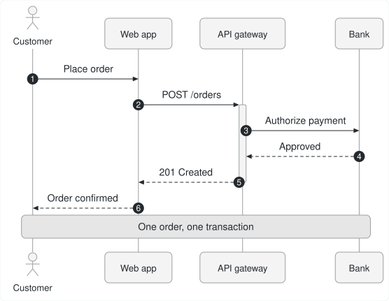

<details>
<summary>View Mermaid Source</summary>

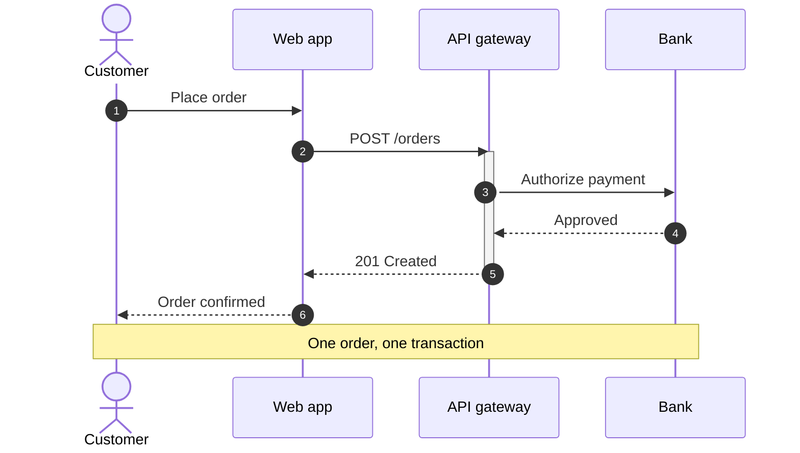
```mermaid
sequenceDiagram
  autonumber
  actor Customer
  participant Web as Web app
  participant API as API gateway
  participant Bank
  Customer->>Web: Place order
  Web->>API: POST /orders
  activate API
  API->>Bank: Authorize payment
  Bank-->>API: Approved
  API-->>Web: 201 Created
  deactivate API
  Web-->>Customer: Order confirmed
  Note over Customer,Bank: One order, one transaction
```
</details>

---

## State

**Type:** `state` (`stateDiagram`) · **Intrinsic Size:** `210×708 px` · Show the states of a system and the transitions between them.

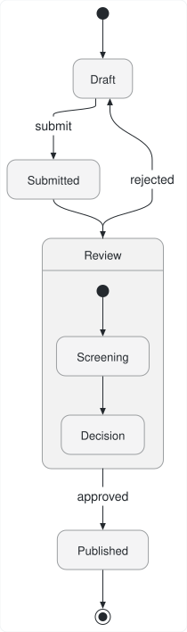

<details>
<summary>View Mermaid Source</summary>

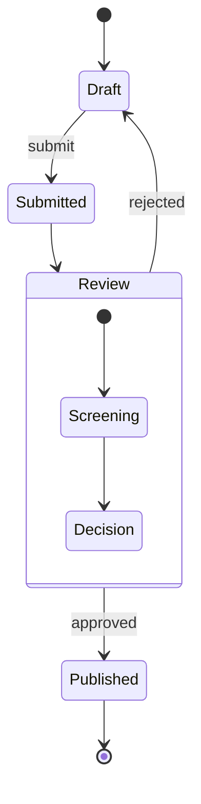
```mermaid
---
config:
  theme: default
  look: classic
  layout: dagre
---
stateDiagram-v2
  [*] --> Draft
  Draft --> Submitted : submit
  state Review {
    [*] --> Screening
    Screening --> Decision
  }
  Submitted --> Review
  Review --> Published : approved
  Review --> Draft : rejected
  Published --> [*]
```
</details>

---

## Timeline

**Type:** `timeline` (`timeline`) · **Intrinsic Size:** `996×254 px` · Show events in chronological order.

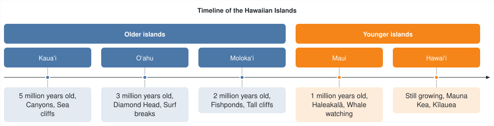

<details>
<summary>View Mermaid Source</summary>

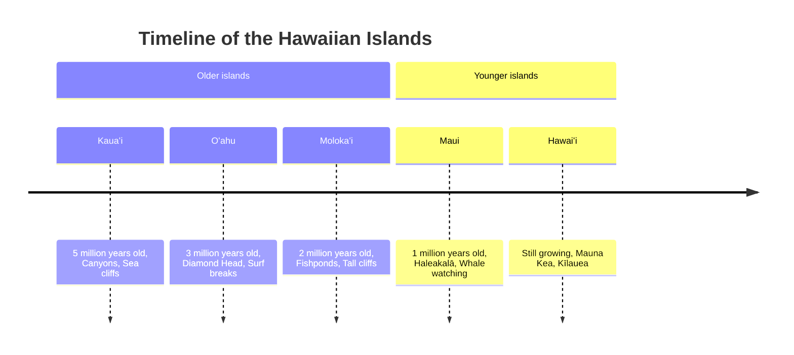
```mermaid
timeline
    title Timeline of the Hawaiian Islands
    section Older islands
        Kauaʻi : 5 million years old, Canyons, Sea <br>cliffs
        Oʻahu : 3 million years old, Diamond Head, Surf breaks
        Molokaʻi : 2 million years old, Fishponds, Tall cliffs
    section Younger islands
        Maui : 1 million years old, Haleakalā, Whale watching
        Hawaiʻi : Still growing, Mauna Kea, Kīlauea
```
</details>

---

## XY chart

**Type:** `xychart` (`xychart`) · **Intrinsic Size:** `700×500 px` · Plot data as bars and lines on two axes.

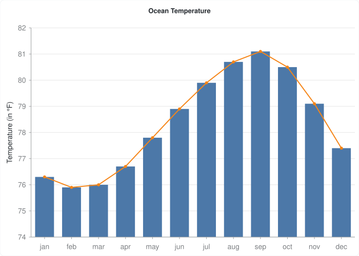

<details>
<summary>View Mermaid Source</summary>

```mermaid
xychart
    title "Ocean Temperature"
    x-axis [jan, feb, mar, apr, may, jun, jul, aug, sep, oct, nov, dec]
    y-axis "Temperature (in °F)" 74 --> 82
    bar [76.3, 75.9, 76.0, 76.7, 77.8, 78.9, 79.9, 80.7, 81.1, 80.5, 79.1, 77.4]
    line [76.3, 75.9, 76.0, 76.7, 77.8, 78.9, 79.9, 80.7, 81.1, 80.5, 79.1, 77.4]
```
</details>

---

## Agentflow

**Type:** `agentflow` (`agentflow`) · **Intrinsic Size:** `443×752 px` · Show the tasks of AI agents and how work passes between them.

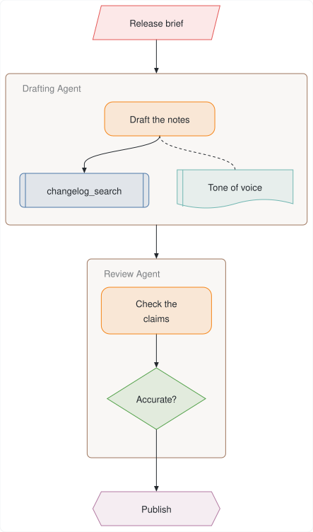

<details>
<summary>View Mermaid Source</summary>

```mermaid
agentflow-beta TB
  brief["Release brief"]@{ shape: input }
  flow writer["Drafting Agent"]
    draft["Draft the notes"]@{ shape: task }
    lookup["changelog_search"]@{ shape: tool }
    guide["Tone of voice"]@{ shape: refdoc }
    draft --> lookup
    draft -.- guide
  end
  flow reviewer["Review Agent"]
    check["Check the claims"]@{ shape: task }
    ok["Accurate?"]@{ shape: decision }
    check --> ok
  end
  publish["Publish"]@{ shape: action }
  brief --> writer
  writer --> reviewer
  ok --> publish
```
</details>

---

## Architecture

**Type:** `architecture` (`architecture`) · **Intrinsic Size:** `224×264 px` · Show services and the connections between them.

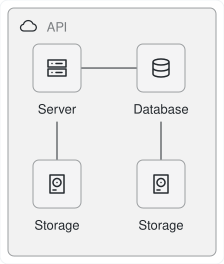

<details>
<summary>View Mermaid Source</summary>

```mermaid
architecture-beta
    group api(cloud)[API]

    service db(database)[Database] in api
    service disk1(disk)[Storage] in api
    service disk2(disk)[Storage] in api
    service server(server)[Server] in api

    db:L -- R:server
    disk1:T -- B:server
    disk2:T -- B:db
```
</details>

---

## Cynefin

**Type:** `cynefin` (`cynefin`) · **Intrinsic Size:** `656×628 px` · Sort items into the five domains of the Cynefin framework.

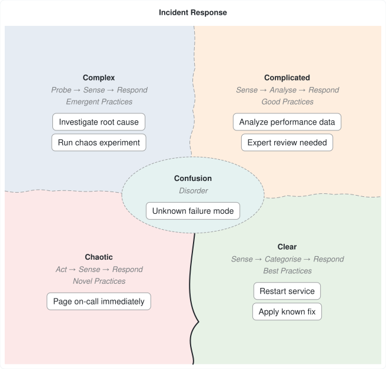

<details>
<summary>View Mermaid Source</summary>

```mermaid
cynefin-beta
  title Incident Response

  complex
    "Investigate root cause"
    "Run chaos experiment"

  complicated
    "Analyze performance data"
    "Expert review needed"

  clear
    "Restart service"
    "Apply known fix"

  chaotic
    "Page on-call immediately"

  confusion
    "Unknown failure mode"
```
</details>

---

## Ishikawa

**Type:** `ishikawa` (`ishikawa`) · **Intrinsic Size:** `696×371 px` · Show the causes that contribute to a problem.

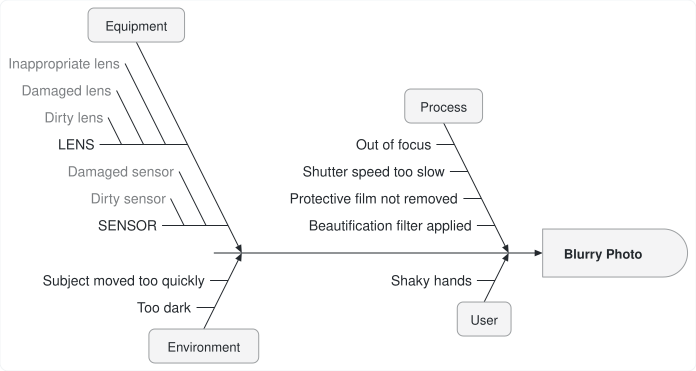

<details>
<summary>View Mermaid Source</summary>

```mermaid
ishikawa-beta
    Blurry Photo
    Process
        Out of focus
        Shutter speed too slow
        Protective film not removed
        Beautification filter applied
    User
        Shaky hands
    Equipment
        LENS
            Inappropriate lens
            Damaged lens
            Dirty lens
        SENSOR
            Damaged sensor
            Dirty sensor
    Environment
        Subject moved too quickly
        Too dark
```
</details>

---

## Radar

**Type:** `radar` (`radar`) · **Intrinsic Size:** `511×438 px` · Compare values across several axes.

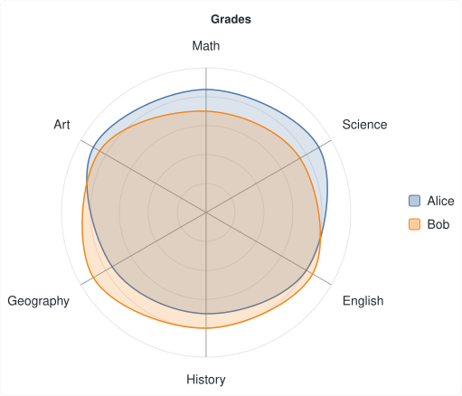

<details>
<summary>View Mermaid Source</summary>

```mermaid
---
title: "Grades"
---
radar-beta
  axis m["Math"], s["Science"], e["English"]
  axis h["History"], g["Geography"], a["Art"]
  curve a["Alice"]{85, 90, 80, 70, 75, 90}
  curve b["Bob"]{70, 75, 85, 80, 90, 85}

  max 100
  min 0
```
</details>

---

## Railroad

**Type:** `railroad` (`railroadEbnf`) · **Intrinsic Size:** `342×1012 px` · Show the syntax of a grammar.

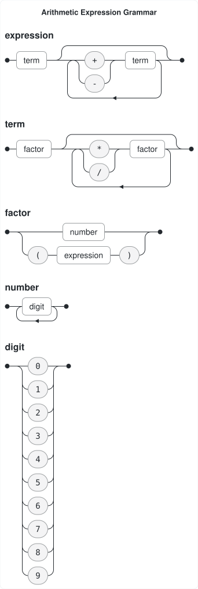

<details>
<summary>View Mermaid Source</summary>

```mermaid
railroad-ebnf-beta
title "Arithmetic Expression Grammar"

expression = term ( ( "+" | "-" ) term )* ;
term = factor ( ( "*" | "/" ) factor )* ;
factor = number | "(" expression ")" ;
number = digit+ ;
digit = "0" | "1" | "2" | "3" | "4" | "5" | "6" | "7" | "8" | "9" ;
```
</details>

---

## Swimlane

**Type:** `swimlane` (`swimlane`) · **Intrinsic Size:** `666×320 px` · Show a process divided by who performs each step.

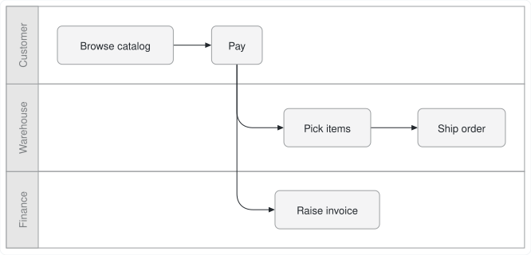

<details>
<summary>View Mermaid Source</summary>

```mermaid
---
config:
  theme: default
  look: classic
---
swimlane-beta LR
  subgraph Customer
    Browse[Browse catalog]
    Pay[Pay]
  end
  subgraph Warehouse
    Pick[Pick items]
    Ship[Ship order]
  end
  subgraph Finance
    Invoice[Raise invoice]
  end
  Browse --> Pay
  Pay --> Pick
  Pick --> Ship
  Pay --> Invoice
```
</details>

---

## Treemap

**Type:** `treemap` (`treemap`) · **Intrinsic Size:** `656×416 px` · Show hierarchical data as nested rectangles, sized by value.

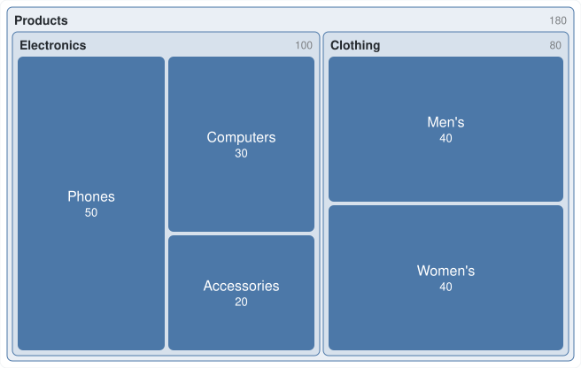

<details>
<summary>View Mermaid Source</summary>

```mermaid
treemap-beta
"Products"
    "Electronics"
        "Phones": 50
        "Computers": 30
        "Accessories": 20
    "Clothing"
        "Men's": 40
        "Women's": 40
```
</details>

---

## Tree view

**Type:** `treeView` (`treeView`) · **Intrinsic Size:** `294×184 px` · Show a hierarchy, such as files and folders.

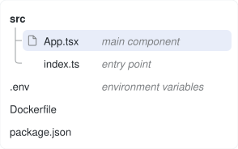

<details>
<summary>View Mermaid Source</summary>

```mermaid
treeView-beta
├── src/
│   ├── App.tsx :::highlight icon(logos:react) ## main component
│   └── index.ts ## entry point
├── .env ## environment variables
├── Dockerfile
└── package.json
```
</details>

---

## Use case

**Type:** `usecase` (`usecase`) · **Intrinsic Size:** `627×304 px` · Show actors and the goals they reach with a system.

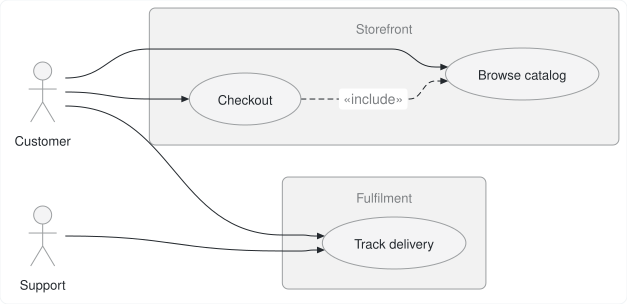

<details>
<summary>View Mermaid Source</summary>

```mermaid
---
config:
  theme: default
  look: classic
  layout: dagre
---
usecase-beta
direction LR
actor Customer
actor Support
systemBoundary Storefront
  Browse("Browse catalog")
  Checkout("Checkout")
end
systemBoundary Fulfilment
  Track("Track delivery")
end
Customer --> Browse
Customer --> Checkout
Customer --> Track
Support --> Track
Checkout ..> : include Browse
```
</details>

---

## Venn

**Type:** `venn` (`venn`) · **Intrinsic Size:** `438×452 px` · Show sets and where they overlap.

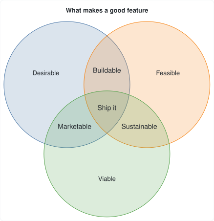

<details>
<summary>View Mermaid Source</summary>

```mermaid
venn-beta
  title What makes a good feature
  set Desirable
  set Feasible
  set Viable
  union Desirable,Feasible["Buildable"]
  union Feasible,Viable["Sustainable"]
  union Desirable,Viable["Marketable"]
  union Desirable,Feasible,Viable["Ship it"]
```
</details>

---

## Wardley map

**Type:** `wardley` (`wardley`) · **Intrinsic Size:** `846×610 px` · Plot components by their visibility to the user and their stage of evolution.

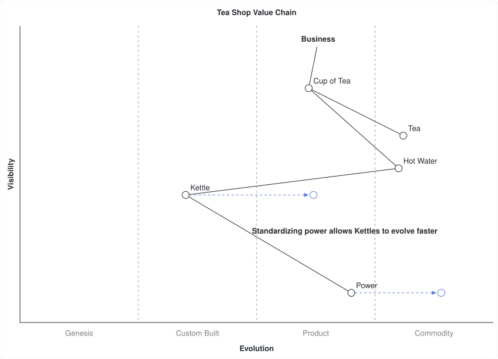

<details>
<summary>View Mermaid Source</summary>

```mermaid
wardley-beta
title Tea Shop Value Chain

anchor Business [0.95, 0.63]
component Cup of Tea [0.79, 0.61]
component Tea [0.63, 0.81]
component Hot Water [0.52, 0.80]
component Kettle [0.43, 0.35]
component Power [0.10, 0.70]

Business -> Cup of Tea
Cup of Tea -> Tea
Cup of Tea -> Hot Water
Hot Water -> Kettle
Kettle -> Power

evolve Kettle 0.62
evolve Power 0.89

note "Standardizing power allows Kettles to evolve faster" [0.30, 0.49]
```
</details>

---

